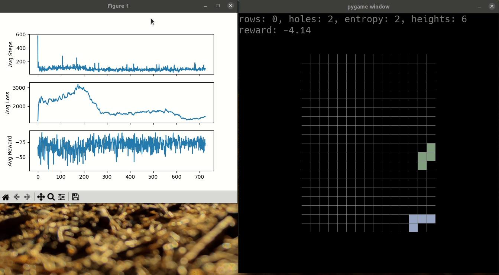

# Deep Q learning play Tetris with interactive plots (WIP)

<p align="center">
    
</p>

# Requirements
```bash
$ mkdir venv
$ python -m venv venv/
$ pip install matplotlib numpy pygame
$ pip install torch torchvision torchaudio --index-url https://download.pytorch.org/whl/cu117
```

# Train
```bash
    $ python main.py
```

# Play
```bash
    $ python play.py
```
Remember to change `fall_speed` in `tetris/constants.py` to higher number.<br>
`n` get new tile<br>
`r` reset whole game<br>
`q`/`esc` quit game

# Experimented Combinations

| States      | Action Space | Tile Fall | Current Results |
| ----------- | -----------  | --------- | --------- |
| (cleared rows, holes, bumpiness, heights) | (up, down, right, left) | True | Fail |
| (cleared rows, holes, bumpiness, heights) | (up, right, left) | False | Fail |
| RGB frames   | (up, down, right, left) | True | Fail |
| RGB frames   | (up, right, left) | True | Fail |
| Binary grids   | (up, down, right, left) | True | Fail |
| Binary grids   | (up, right, left) | True | Fail |

# Experimenting

- [ ] Skip n-frames
- [ ] Weighted heights
- [ ] Simplified action space: (right, left, space)
- [ ] cols x 1 Convolution
- [ ] DDQN
- [ ] Skip Frames
- [ ] More algorithm
